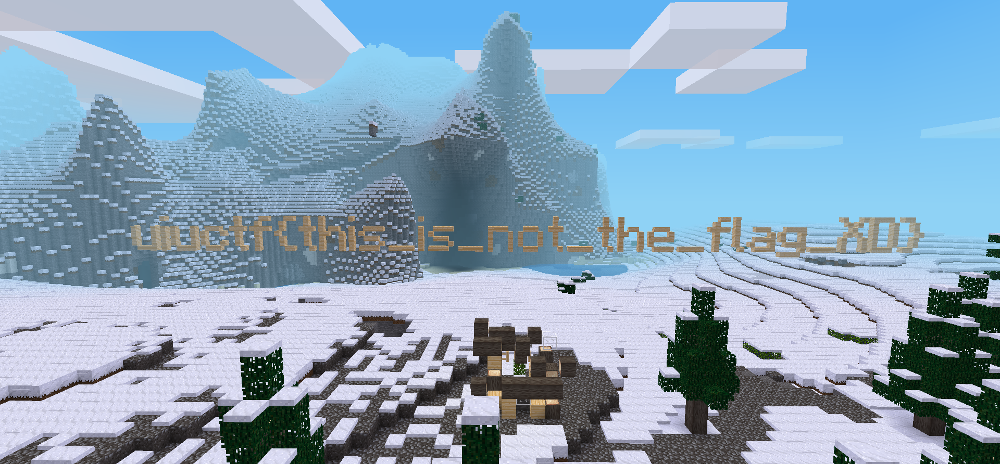
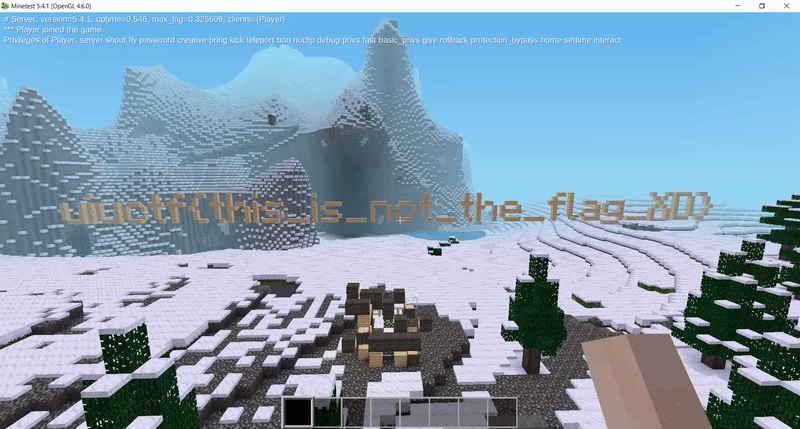

# toobeetootee solution

## Overview

- Use Minetest Wireshark filter from [here](https://github.com/minetest/minetest/blob/master/util/wireshark/minetest.lua).
- Identify and extract coordinates where blocks (nodes) were placed and removed.
- Use Minetest modding API to reverse nodes placed and removed at the coordinates.

## Detailed

After installing Minetest and loading the world file, we can see a flag built with nodes.



However, as stated in the challenge description, this flag was tampered with.

Initially looking at the packet capture, we see lots of UDP packets, but Wireshark doesn't understand the Minetest protocol. Fortunately, a Wireshark plugin can be found on the [Minetest GitHub repo](https://github.com/minetest/minetest/blob/master/util/wireshark/minetest.lua), which can be installed locally at the path `~/.wireshark/plugins/minetest.lua`.

We then need to identify packets where nodes were removed and where nodes were placed. The following `tshark` filter extracts coordinates into `coords.txt`.

```
tshark -r toobeetootee.pcap -Y 'minetest.server.command == 0x0022 || minetest.client.interact_action==3' -Tfields \
-e minetest.server.removenode_x \
-e minetest.server.removenode_y \
-e minetest.server.removenode_z \
-e minetest.client.interact_pointed_above_x > coords.txt
```

`minetest.server.command == 0x0022` filters packets where nodes were removed. `minetest.client.interact_action == 3` filters packets where nodes were placed. 

Note: `minetest.client.interact_pointed_above_x` represents the full coordinates of the placed node. Also, there are additional coordinates included in the packet which represent the node the player had their crosshair aimed at: `minetest.client.interact_pointed_above_(x||y||z)` are irrelevant for this challenge.

Now we need a way to place and remove nodes at specified coordinates programmatically. The easiest way is to create a Minetest mod, which sounds like more work than it really is. According to the documentation, the [set_node](https://dev.minetest.net/minetest.set_node) and [remove_node](https://dev.minetest.net/minetest.remove_node) methods will work.

Create a folder named `worldmods` inside the world folder, and add another folder named `flag` in this folder. Then, create a file named `init.lua`.

Going off of the example in the documentation, we can run methods when a player joins the server.

```lua
minetest.register_on_joinplayer(function(player)
    minetest.set_node({x=1, y=2, z=3}, {name="default:dirt"})
    minetest.remove_node({x=4,y=5,z=6})
    --> and so on
end)
```

Another option is to register a chat command, which is what I used.

```lua
minetest.register_chatcommand("flag", {
    func = function()
    minetest.set_node({x=1, y=2, z=3}, {name="default:dirt"})
    minetest.remove_node({x=4,y=5,z=6})
    --> and so on
    return true
    end
})
```

Now we use `awk` to generate method calls with the coordinates from `coords.txt` while also reversing the action (so a placed node needs to be removed and a removed node needs to be placed).

```
awk -F '\t|,' '{if($1==""){print "minetest.remove_node({x="$4", y="$5", z="$6"})"}else{print "minetest.set_node({x="$1", y="$2", z="$3"}, {name=\"default:pine_wood\"})"}}' coords.txt | tac
```

We can copy the generated methods into `init.lua`, start the world, and run `/flag`.



```
uiuctf{BudG3t_c4ves_N_cl1fFs}
```